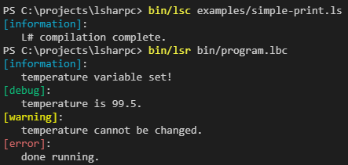

# L#
L# ("L Sharp") is a programming language initially written in C. It has a few goals in mind:

- L# is intended to be easy-to-write, easy-to-read, immutable by default, general-purpose, extensible, platform-agnostic programming language
- The language is intended to interoperate with other systems and languages
- The language does not allow code that would violate any memory safety; memory should not be a concern of the programmer
- The language does not enforce any specific architecture or structure (with spaces, folders, groupings of files, or brackets), rather, the programmer decides and implements how they see fit
- L# applications are intended to be economical with regard to memory and processing, the language is intended to compete directly on performance and size with C or assembly language

If you're curious, you can read more about it in the [L# language spec](spec) included in this repo.

## Syntax

Here is a sample of some [simple L# source code](./examples/simple-print.ls):

```lsharp
number temperature = 98.5 + 1

/* the info, debug, warning, and error functions are built-in to L# */
info('temperature variable set!')
debug('temperature is 99.5.')
warning('temperature cannot be changed.')
error('done running.')
```

When compiling and running this file, the output will look like this:



## Getting Started
1. Clone or fork the repo
1. Navigate to project root
1. Use the [makefile](makefile) to compile or clean the project
    - `make` compiles both the compiler and the runtime
    - `make compiler` compiles the compiler
    - `make runtime` compiles the runtime
    - `make tests` compiles the unit tests for the program
    - `make clean` removes all build artifacts, docs, and the compiled program
    - `make docs` generates and launches the documentation
    - `make rebuild` runs `make clean` then `make`
1. Run `bin/lsc examples/simple.ls` to compile the simple L# source code into a bytecode program file
1. Run `bin/lsr program.lbc` to run the bytecode file

## Architecture
The compiler will read the L# file, tokenize the source code, then break the tokens into an abstract syntax tree.

The abstract syntax tree is then translated to bytecode instructions through code generation, which will create an .lbc (L# bytecode) file.

The .lbc file is then run by the LVM (L# virtual machine) which produces the output of the program.

## Todo
- Finish L# language spec
- Finish L# VSCode extension
- Create a release of the L# compiler in this repository
- Create an L# compiler in L#